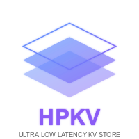

  
  
  <h1>Zustand Multiplayer</h1>
  
  

    <strong>Transform any Zustand store into a real-time synchronized multiplayer experience</strong>
  

  

    
    
    
  

---

This monorepo contains the **Zustand Multiplayer** middleware and related packages. Zustand Multiplayer enables real-time synchronization of Zustand stores across multiple clients without requiring you to set up WebSocket servers or handle complex synchronization logic.

## 📦 Packages

This monorepo is organized using [pnpm workspaces](https://pnpm.io/workspaces) and [Turborepo](https://turbo.build/repo).

### Core Package

| Package | Version | Description |
|---------|---------|-------------|
| [@hpkv/zustand-multiplayer](packages/zustand-multiplayer) |  | Real-time multiplayer middleware for Zustand |

### Internal Packages

| Package | Description |
|---------|-------------|
| [@repo/eslint-config](packages/eslint-config) | Shared ESLint configurations |
| [@repo/typescript-config](packages/typescript-config) | Shared TypeScript configurations |

## 📚 Examples

Explore our example applications to see Zustand Multiplayer in action:

### [Next.js Chat App](examples/nextjs-chat)
A real-time chat application built with Next.js demonstrating:
- Real-time chat synchronization
- TypeScript integration
- Token-based authentication

### [JavaScript Chat App](examples/javascript-chat)
A vanilla JavaScript chat implementation showing:
- Framework-free real-time chat
- Vite-based development
- Pure JavaScript approach
- Token-based authentication

### [Next.js Collaborative Todo](examples/nextjs-collaborative-todo)
A full-stack Next.js application demonstrating:
- Real-time todo synchronization
- TypeScript integration
- Token-based authentication

### [JavaScript Collaborative Todo](examples/javascript-collaborative-todo)
A vanilla JavaScript implementation showing:
- Framework-free real-time sync
- Simple Express.js backend
- Minimal setup requirements
- Token-based authentication

## Support

- **Documentation**: [Full Documentation](packages/zustand-multiplayer#readme)
- **Issues**: [GitHub Issues](https://github.com/hpkv-io/zustand-multiplayer/issues)
- **Discussions**: [GitHub Discussions](https://github.com/hpkv-io/zustand-multiplayer/discussions)
- **Email**: support@hpkv.io
