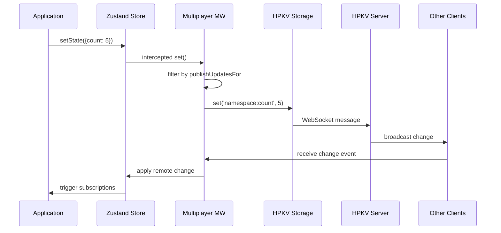
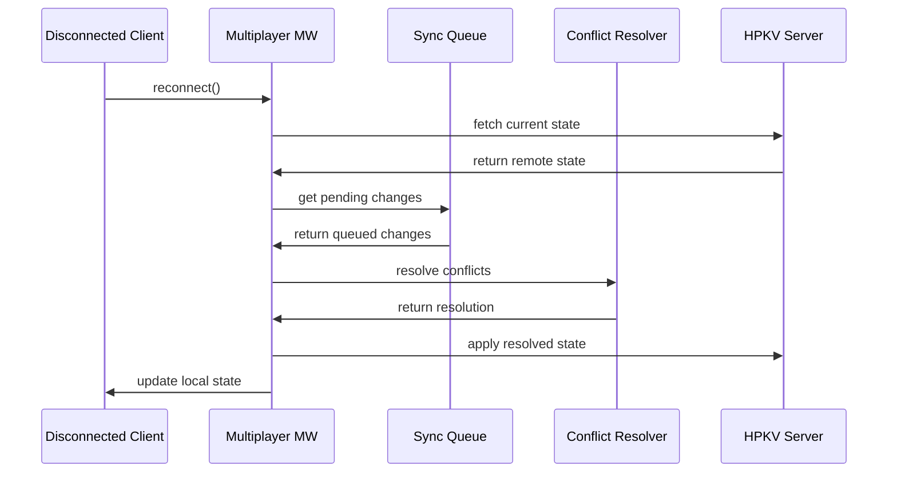
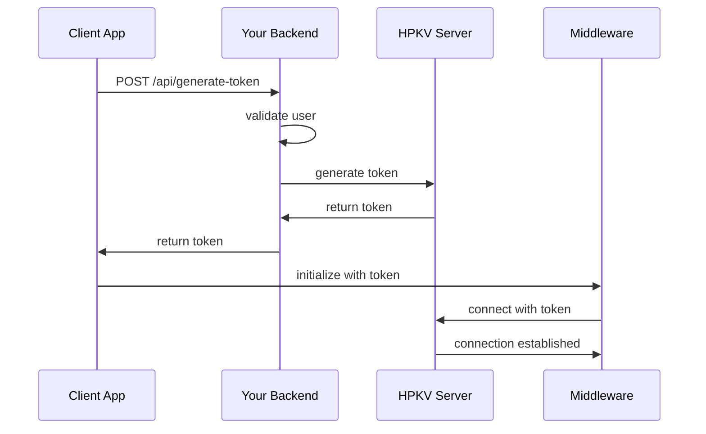

# Technical Design

This document provides a detailed technical overview of the Zustand Multiplayer Middleware architecture, design decisions, and implementation details.

## Table of Contents

- [Architecture Overview](#architecture-overview)
- [Core Components](#core-components)
- [Data Flow](#data-flow)
- [State Management](#state-management)
- [Conflict Resolution](#conflict-resolution)
- [Performance Optimizations](#performance-optimizations)
- [Error Handling](#error-handling)
- [Security Model](#security-model)
- [Testing Strategy](#testing-strategy)
- [Design Decisions](#design-decisions)

## Architecture Overview

The Zustand Multiplayer Middleware follows a layered architecture with clear separation of concerns:

```
Application Layer (React/Vue/Server Apps)
           ↓
Zustand Store Layer (Multiplayer Middleware)
           ↓
Communication Layer (HPKV Storage)
           ↓
HPKV Backend (WebSocket/Persistence/Pub-Sub)
```

## Core Components

### 1. MultiplayerOrchestrator

**Location:** `src/multiplayer.ts`

The central coordinator that manages the entire multiplayer lifecycle.

#### Responsibilities:

- **Initialization**: Sets up all sub-components and establishes connections
- **State Hydration**: Manages initial and ongoing state synchronization
- **Change Interception**: Hooks into Zustand's `set` function to detect local changes
- **Event Coordination**: Orchestrates communication between components
- **Lifecycle Management**: Handles connection, disconnection, and cleanup

#### Key Methods:

```typescript
class MultiplayerOrchestrator<TState> {
  async hydrate(): Promise<void>;
  async applyStateChange(
    partial: Partial<TState>,
    replace?: boolean,
    isRemoteUpdate?: boolean,
  ): Promise<void>;
  handleStateChangeRequest(partial: Partial<TState>, replace?: boolean): void;
  private async processConflictsAndPendingChanges(): Promise<void>;
  private async syncStateToRemote(state: Partial<TState>): Promise<void>;
}
```

#### Design Patterns:

- **Orchestrator Pattern**: Coordinates multiple subsystems
- **Observer Pattern**: Listens to connection and storage events
- **Command Pattern**: Queues and processes state changes

### 2. HPKVStorage

**Location:** `src/hpkvStorage.ts`

Provides the storage and communication abstraction layer over HPKV's WebSocket client.

#### Responsibilities:

- **Connection Management**: Maintains WebSocket connection lifecycle
- **Key-Value Operations**: Abstracts HPKV operations with namespace support
- **Event Streaming**: Provides real-time change notifications
- **Token Management**: Handles authentication and token refresh

#### Key Features:

```typescript
class HPKVStorage {
  async getAllItems(): Promise<Map<string, unknown>>;
  async setItem(key: string, value: unknown): Promise<void>;
  async removeItem(key: string): Promise<void>;
  async clear(): Promise<void>;
  addChangeListener(listener: (event: HPKVChangeEvent) => void): () => void;
  addConnectionListener(listener: (state: ConnectionState) => void): () => void;
}
```

#### Token Caching:

- **Secure Storage**: Authentication tokens cached in memory
- **Auto-Refresh**: Tokens refreshed before expiration
- **Security**: Sensitive data cleared on destruction

### 3. ConflictResolver

**Location:** `src/conflictResolver.ts`

Handles conflicts that arise when multiple clients modify the same data while disconnected.

#### Conflict Detection:

```typescript
interface ConflictInfo<TState> {
  field: keyof TState;
  localValue: TState[keyof TState];
  remoteValue: TState[keyof TState];
  pendingValue: TState[keyof TState];
  timestamp: number;
}
```

#### Resolution Strategies:

1. **Keep Remote** (Default): Prefer server state
2. **Keep Local**: Prefer local changes
3. **Merge**: Custom merge logic provided by user

#### Algorithm:

```typescript
async resolveConflicts<TState>(
  remoteState: Partial<TState>,
  pendingChanges: StateChange<TState>[],
  resolver?: ConflictResolver<TState>
): Promise<Partial<TState>>
```

### 4. SyncQueueManager

**Location:** `src/multiplayer.ts` (internal class)

Manages pending state changes during disconnections and ensures proper ordering.

#### Queue Management:

- **FIFO Ordering**: Changes applied in chronological order
- **Deduplication**: Removes redundant changes to same fields
- **Batching**: Groups multiple changes for efficient processing

#### Data Structure:

```typescript
interface StateChange<TState> {
  id: string;
  field: keyof TState;
  value: TState[keyof TState];
  timestamp: number;
  operation: 'set' | 'delete';
}
```

### 5. StateHydrator

**Location:** `src/multiplayer.ts` (internal class)

Manages the initial and ongoing state hydration process.

#### Hydration Process:

1. **Fetch Remote State**: Get current state from HPKV
2. **Merge with Local**: Combine with initial state
3. **Apply Changes**: Update Zustand store
4. **Trigger Callbacks**: Call `onHydrate` hook

#### Performance Optimizations:

- **Incremental Hydration**: Only fetch changed keys when possible
- **Efficient Serialization**: Optimized data transfer
- **Batch Operations**: Group multiple operations when possible

## Data Flow

### State Change Propagation



### Conflict Resolution Flow



## State Management

### Namespace Design

Each store operates within a unique namespace that provides:

1. **Isolation**: Prevents cross-store interference
2. **Organization**: Logical grouping of related data
3. **Security**: Access control at namespace level

#### Key Structure:

```
namespace:field -> "my-app:todos"
namespace:field -> "my-app:settings"
namespace:field -> "chat-room-123:messages"
```

### Selective Synchronization

The middleware supports fine-grained control over what gets synchronized:

#### Publisher Configuration:

```typescript
publishUpdatesFor: () => ['todos', 'settings']; // Only these fields are sent
```

#### Subscriber Configuration:

```typescript
subscribeToUpdatesFor: () => ['todos', 'users']; // Only these fields are received
```

#### Benefits:

- **Bandwidth Optimization**: Reduce unnecessary network traffic
- **Privacy Control**: Keep sensitive data local
- **Performance**: Faster synchronization of relevant data

### State Serialization

The middleware handles complex state serialization:

#### Supported Types:

- Primitives (string, number, boolean)
- Objects and nested objects
- Arrays and nested arrays
- Dates (serialized as ISO strings)
- Custom serializable objects

#### Limitations:

- Functions are not serialized
- Circular references are not supported
- Class instances lose their prototype

## Conflict Resolution

### Detection Algorithm

Conflicts are detected during reconnection by comparing:

1. **Remote State**: Current server state
2. **Local State**: State before disconnection
3. **Pending Changes**: Changes made while offline

```typescript
function detectConflicts<TState>(
  remoteState: Partial<TState>,
  localStateBeforeDisconnection: TState,
  pendingChanges: StateChange<TState>[],
): ConflictInfo<TState>[];
```

### Resolution Strategies

#### 1. Keep Remote (Default)

- **Use Case**: When server state is authoritative
- **Implementation**: Discard local changes, use remote state
- **Trade-off**: Simple but may lose user work

#### 2. Keep Local

- **Use Case**: When local changes are more important
- **Implementation**: Apply local changes over remote state
- **Trade-off**: May overwrite other users' changes

#### 3. Merge

- **Use Case**: When both states have value
- **Implementation**: Custom merge logic provided by user
- **Trade-off**: Complex but preserves all data

### Custom Merge Example

```typescript
onConflict: conflicts => {
  const todoConflict = conflicts.find(c => c.field === 'todos');
  if (todoConflict) {
    // Merge todo arrays by ID
    const remoteTodos = todoConflict.remoteValue as Todo[];
    const localTodos = todoConflict.pendingValue as Todo[];

    const mergedTodos = mergeTodoArrays(remoteTodos, localTodos);

    return {
      strategy: 'merge',
      mergedValues: { todos: mergedTodos },
    };
  }

  return { strategy: 'keep-remote' };
};
```

## Performance Optimizations

### 1. Token Caching

### SecureTokenCache

The only caching implementation is for authentication tokens:

**Purpose**: Securely stores WebSocket authentication tokens with automatic expiration handling.

**Implementation**:

```typescript
class SecureTokenCache {
  private tokenData: { token: string; expiresAt: number } | null = null;
  private isRefreshing: boolean = false;

  set(token: string, expiresAt: number): void {
    this.tokenData = { token, expiresAt };
  }

  get(): { token: string; expiresAt: number } | null {
    return this.tokenData;
  }

  clear(): void {
    if (this.tokenData) {
      // Overwrite sensitive data before clearing
      this.tokenData.token = '';
      this.tokenData = null;
    }
  }

  isValid(): boolean {
    return this.tokenData !== null && Date.now() < this.tokenData.expiresAt;
  }
}
```

**Security Features**:

- Overwrites token data before clearing to prevent memory dumps
- Automatic expiration validation
- Prevents concurrent refresh operations

### 2. Connection Management

**Implementation**: Efficient WebSocket connection handling

**Benefits**:

- Automatic reconnection with exponential backoff
- Connection state tracking and throttling
- Proper cleanup and resource management

### 3. Selective Synchronization

**Implementation**: Configurable filtering of published/subscribed data

**Benefits**:

- Reduced bandwidth usage
- Better performance for large states
- Privacy control over synchronized data

### 4. Performance Monitoring

**Implementation**: Built-in metrics collection when `profiling: true`

**Available Metrics**:

```typescript
interface PerformanceMetrics {
  stateChangesProcessed: number; // Total state changes handled
  averageHydrationTime: number; // Average hydration time (ms)
  averageSyncTime: number; // Average sync operation time (ms)
}
```

**Features**:

- Rolling averages for timing metrics (last 100 operations)
- Automatic cleanup of old data points
- Zero overhead when profiling is disabled

## Error Handling

### Error Hierarchy

```typescript
class MultiplayerError extends Error {
  constructor(
    message: string,
    public readonly code: string,
    public readonly recoverable: boolean = true,
    public readonly context?: Record<string, unknown>
  )
}

class ConnectionError extends MultiplayerError
class AuthenticationError extends MultiplayerError
class HydrationError extends MultiplayerError
class SyncError extends MultiplayerError
```

### Recovery Strategies

#### 1. Automatic Retry

- **Exponential Backoff**: Increasing delays between retries
- **Jitter**: Random delay to prevent thundering herd
- **Circuit Breaker**: Stop retrying after consecutive failures

#### 2. Graceful Degradation

- **Offline Mode**: Continue working with local state
- **Queue Operations**: Store changes for later sync
- **User Notification**: Inform user of connection issues

#### 3. Error Reporting

- **Structured Logging**: Consistent error format
- **Context Preservation**: Include relevant state information
- **User-Friendly Messages**: Translate technical errors

### Retry Configuration

```typescript
interface RetryConfig {
  maxRetries: number; // Maximum attempts
  baseDelay: number; // Initial delay (ms)
  maxDelay: number; // Maximum delay (ms)
  backoffFactor: number; // Exponential multiplier
}
```

## Security Model

### Authentication Flow


