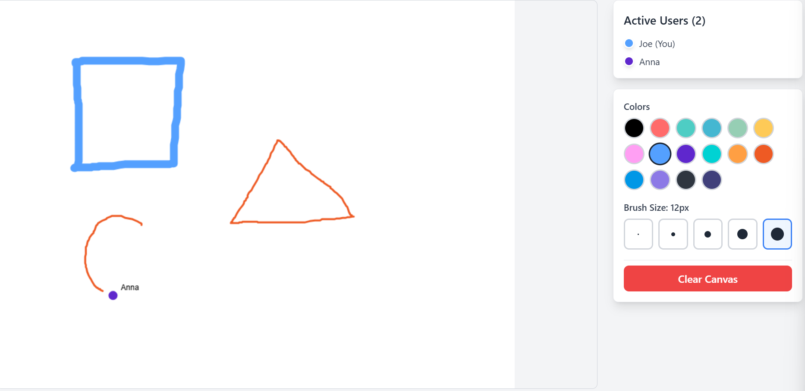
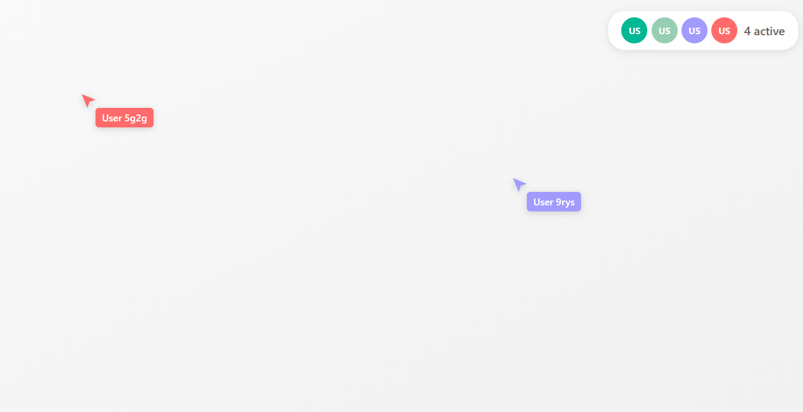

# 📚 Zustand Multiplayer Examples

Welcome to the Zustand Multiplayer examples! These examples demonstrate various real-time collaborative applications built with the Zustand Multiplayer middleware.

## 🚀 Available Examples

<div align="center">

### Next.js Chat Application
[](./nextjs-chat)

**Real-time chat application with message synchronization and user management**


[📖 View Documentation](./nextjs-chat/README.md) | [🔧 Run Example](./nextjs-chat)

---

### JavaScript Chat Application
[](./javascript-chat)

**Framework-free vanilla JavaScript chat with Vite development setup**


[📖 View Documentation](./javascript-chat/README.md) | [🔧 Run Example](./javascript-chat)

---

### Next.js Collaborative Todo List
[](./nextjs-collaborative-todo)

**Full-stack todo application with real-time task synchronization**


[📖 View Documentation](./nextjs-collaborative-todo/README.md) | [🔧 Run Example](./nextjs-collaborative-todo)

---

### JavaScript Collaborative Todo List
[](./javascript-collaborative-todo)

**Vanilla JavaScript todo app with minimal Express.js backend**


[📖 View Documentation](./javascript-collaborative-todo/README.md) | [🔧 Run Example](./javascript-collaborative-todo)

---

### Next.js Tic-Tac-Toe Game
[](./nextjs-tic-tac-toe)

**Multiplayer tic-tac-toe game with live scoreboard and turn management**


[📖 View Documentation](./nextjs-tic-tac-toe/README.md) | [🔧 Run Example](./nextjs-tic-tac-toe)

---

### Next.js Collaborative Drawing Canvas
[](./nextjs-collaborative-drawing)

**Real-time collaborative drawing canvas with live cursors and synchronized strokes**


[📖 View Documentation](./nextjs-collaborative-drawing/README.md) | [🔧 Run Example](./nextjs-collaborative-drawing)

---

### React Live Cursors
[](./react-live-cursors)

**Real-time collaborative cursor tracking with React**


[📖 View Documentation](./react-live-cursors/README.md) | [🔧 Run Example](./react-live-cursors)

---

### JavaScript Live Cursors
[](./javascript-live-cursors)

**Vanilla JavaScript live cursor tracking with real-time synchronization**


[📖 View Documentation](./javascript-live-cursors/README.md) | [🔧 Run Example](./javascript-live-cursors)

</div>

## 🛠️ Quick Start Guide

### Prerequisites

All examples require an API key from HPKV:

1. Sign up at [HPKV Website](https://hpkv.io/signup)
2. Navigate to [Dashboard](https://hpkv.io/dashboard)
3. Create an API Key
4. Note down the API Key and API Base URL

### Running Examples

1. **Clone the repository:**
   ```bash
   git clone https://github.com/hpkv-io/zustand-multiplayer.git
   cd zustand-multiplayer
   pnpm install
   ```

2. **Build the core package:**
   ```bash
   pnpm turbo build --filter=@hpkv/zustand-multiplayer
   ```

3. **Choose and run an example:**
   ```bash
   # Next.js examples
   pnpm --filter nextjs-chat dev
   pnpm --filter nextjs-collaborative-todo dev
   pnpm --filter nextjs-tic-tac-toe dev
   pnpm --filter nextjs-collaborative-drawing dev
   
   # JavaScript examples
   pnpm --filter javascript-chat dev
   pnpm --filter javascript-collaborative-todo dev
   pnpm --filter javascript-live-cursors dev
   pnpm --filter react-live-cursors dev
   ```

4. **Set up environment variables** for each example (see individual README files)

## 📖 Documentation

- [Zustand Multiplayer Documentation](../packages/zustand-multiplayer/README.md)
- [HPKV Platform](https://hpkv.io)
- [API Reference](../packages/zustand-multiplayer/docs)

## 🤝 Contributing

Want to contribute an example? We'd love to see:
- New use cases (collaborative editors, games, visual tools)
- Different frameworks (Vue, Svelte, Angular)
- Mobile examples (React Native, Ionic)
- Desktop applications (Electron, Tauri)

Check out our [Contributing Guidelines](../CONTRIBUTING.md) to get started!

## 📄 License

All examples are provided under the [MIT License](../LICENSE).