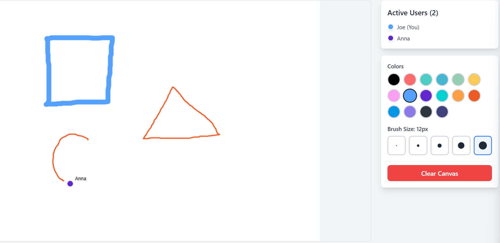

# Next.js Collaborative Drawing Canvas with Zustand Multiplayer


A real-time collaborative drawing canvas built with Next.js and Zustand Multiplayer middleware, demonstrating how to create visual collaborative applications with synchronized drawing strokes and live cursors.



## Features

- 🎨 **Real-time Drawing**: Multiple users can draw simultaneously with instant synchronization
- 🖱️ **Live Drawing**: See other users' drawing in realtime as they draw
- 🎨 **Color Palette**: Choose from 16 different colors for drawing
- 📏 **Brush Sizes**: 5 different brush thickness options (1px to 12px)
- 👥 **Active Users**: Live list of all connected users with their assigned colors
- 🧹 **Clear Canvas**: Collaboratively clear the entire canvas
- 🔗 **Connection Status**: Visual indicator of connection state

## Technical Highlights

### Efficient State Management
- **Stroke Chunking**: Large drawing strokes are automatically split into 8-point chunks to stay within the size limitation of HPKV key values
- **Optimized Rendering**: Canvas efficiently redraws only when necessary using React hooks
- **User Identification**: Each user gets a unique color and identifier for visual distinction

### Real-time Synchronization
- **Drawing Strokes**: All drawing data is synchronized across clients instantly
- **Cursor Tracking**: Live cursor positions with automatic cleanup after 3 seconds
- **User Management**: Real-time user join/leave detection

## Prerequisites

You need an API key to run this example:

- Sign up at [HPKV Website](https://hpkv.io/signup)
- Navigate to [Dashboard](https://hpkv.io/dashboard)
- Create an API Key  
- Note down the API Key and API Base URL. Follow the instructions below to set these values in your .env file

## Getting Started

1. **Clone and setup the monorepo:**
   ```bash
   git clone https://github.com/hpkv-io/zustand-multiplayer.git
   cd zustand-multiplayer
   pnpm install
   ```

2. **Environment Setup:**
   Copy the example environment file in this directory:
   ```bash
   cp examples/nextjs-collaborative-drawing/.env.example examples/nextjs-collaborative-drawing/.env.local
   ```

   Edit the `.env.local` file with your HPKV credentials:
   ```env
   HPKV_API_KEY=your_api_key_here
   HPKV_API_BASE_URL=your_api_base_url
   NEXT_PUBLIC_HPKV_API_BASE_URL=your_api_base_url
   NEXT_PUBLIC_SERVER_URL=http://localhost:3000
   ```

3. **Build the package (required):**
   ```bash
   # From monorepo root - build the zustand-multiplayer package first
   pnpm turbo build --filter=@hpkv/zustand-multiplayer
   ```

4. **Run the example:**
   ```bash
   # From monorepo root
   pnpm --filter nextjs-collaborative-drawing dev
   
   # Or use Turbo
   pnpm turbo dev --filter nextjs-collaborative-drawing
   ```

5. **Start drawing together:**
   Navigate to `http://localhost:3000` in multiple browser windows, enter usernames, and start drawing together in real-time!

## How It Works

### State Architecture

```typescript
interface StrokeChunk {
  id: string;
  strokeId: string;
  chunkIndex: number;
  points: Point[];
  color: string;
  thickness: number;
  timestamp: number;
  userId: string;
  username: string;
}
```

- **Stroke Chunking**: Long drawing strokes are automatically split into chunks of 8 points each
- **Unique Identifiers**: Each chunk has a unique ID while maintaining stroke continuity
- **Efficient Storage**: Points are stored as simple `{x, y}` coordinates to minimize data size

### Real-time Features
- **Drawing Synchronization**: Every stroke chunk is synchronized across all connected clients
- **Live Cursors**: Cursor positions are shared with automatic cleanup
- **User Presence**: Real-time user list with color-coded identification
- **Connection Status**: Visual feedback on connection state

### Canvas Rendering
- **Efficient Redrawing**: Canvas redraws only when stroke data changes
- **Stroke Reconstruction**: Chunks are reassembled into complete strokes for smooth rendering
- **Live Preview**: Current drawing stroke is shown in real-time before completion

## Code Structure

```
src/
├── components/
│   ├── DrawingApp.tsx      # Main application component
│   ├── DrawingCanvas.tsx   # Canvas with drawing logic
│   ├── Toolbar.tsx         # Color and brush size controls
│   ├── UserList.tsx        # Active users display
│   ├── UsernameModal.tsx   # User identification modal
│   └── ConnectionStatus.tsx # Connection state indicator
├── lib/
│   └── store.ts            # Zustand store with multiplayer middleware
├── pages/
│   ├── api/
│   │   └── generate-token.ts # Token generation API
│   ├── _app.tsx
│   └── index.tsx
└── styles/
    └── globals.css         # Tailwind CSS styles
```

## Development Tips

### Adding New Features
1. **New Tools**: Add new drawing tools by extending the toolbar and canvas drawing logic
2. **Stroke Properties**: Add new stroke properties (opacity, texture) to the `StrokeChunk` interface
3. **Shapes**: Implement shape tools by creating dedicated shape state management

### Performance Optimization
- **Chunk Size**: Adjust `CHUNK_SIZE` constant to balance between sync frequency and data size
- **Cursor Updates**: Modify cursor update frequency for different performance characteristics
- **Canvas Size**: Adjust canvas dimensions based on your use case

### Data Size Management
- Keep individual state values under 1024 bytes
- Use efficient data structures (arrays of numbers rather than objects)
- Consider compression for complex drawing data

## Learn More

- [Zustand Multiplayer Documentation](../../packages/zustand-multiplayer/README.md)
- [HPKV Platform](https://hpkv.io)
- [Next.js Documentation](https://nextjs.org/docs)
- [Zustand Documentation](https://zustand.docs.pmnd.rs/)