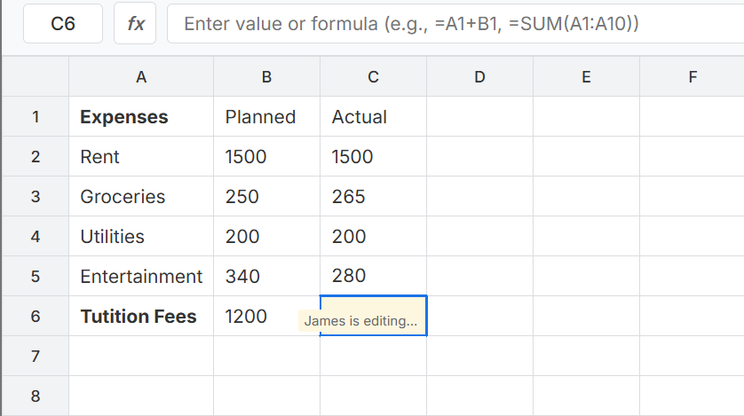

# Next.js Collaborative Spreadsheet Example


This example demonstrates a real-time collaborative spreadsheet application built with Next.js and Zustand Multiplayer middleware. Multiple users can edit cells, apply formatting, and see each other's changes in real-time.



## Features

- **Real-time Collaboration**: See other users' edits and selections instantly
- **Formula Support**: Basic spreadsheet formulas (SUM, AVERAGE, COUNT, arithmetic operations)
- **Cell Formatting**: Bold, italic, underline, text color, background color, font size, and alignment
- **User Presence**: See who's online and which cells they're editing
- **Keyboard Shortcuts**: 
  - `Enter` - Edit cell or move down
  - `Tab` - Move right
  - `Escape` - Cancel editing
  - `Ctrl/Cmd + C` - Copy cell
  - `Ctrl/Cmd + V` - Paste cell
  - `Ctrl/Cmd + X` - Cut cell
  - `Delete/Backspace` - Clear cell
- **Cell References**: Reference other cells in formulas (e.g., `=A1+B1`)
- **Range Functions**: Use ranges in formulas (e.g., `=SUM(A1:A10)`)

## Prerequisites

- HPKV API credentials (get them at [hpkv.io](https://hpkv.io))

## Setup

1. **Install dependencies**:
   ```bash
   pnpm install
   ```

2. **Configure environment variables**:
   
   Copy `.env.example` to `.env.local`:
   ```bash
   cp .env.example .env.local
   ```

   Then update the values in `.env.local`:
   ```env
   HPKV_API_KEY=your_api_key_here
   HPKV_API_BASE_URL=your_api_base_url
   NEXT_PUBLIC_HPKV_API_BASE_URL=your_api_base_url
   NEXT_PUBLIC_SERVER_URL=http://localhost:3000
   ```

3. **Run the development server**:
   ```bash
   pnpm dev
   ```

4. **Open the application**:
   
   Navigate to [http://localhost:3000](http://localhost:3000) in your browser.

5. **Test collaboration**:
   
   Open the application in multiple browser tabs or different browsers to see real-time synchronization.

## How It Works

### Store Structure

The spreadsheet store manages:
- **Cells**: Individual cell data including value, formula, and styling
- **Users**: Active users and their selected cells
- **History**: Action history for audit trail
- **Editing State**: Track which cells are being edited and by whom

### Formula System

The spreadsheet supports:
- **Basic arithmetic**: `=A1+B1-C1*2/D1`
- **SUM function**: `=SUM(A1:A10)` - Sum a range of cells
- **AVERAGE function**: `=AVERAGE(B1:B20)` - Calculate average
- **COUNT function**: `=COUNT(C1:C30)` - Count non-empty cells
- **Cell references**: `=A1` - Reference another cell's value

### Real-time Synchronization

Using Zustand Multiplayer middleware:
- Cell edits are instantly synchronized across all clients
- User selections are visually indicated with colored borders
- Editing locks prevent conflicts when multiple users edit the same cell
- Connection status is displayed in the header

### User Experience

- **Join with username**: Simple onboarding to identify users
- **Visual indicators**: See other users' cursors and selections
- **Collaborative editing**: Real-time updates without conflicts
- **Formula bar**: Edit formulas and see cell contents
- **Toolbar**: Format cells with various styling options

## Project Structure

```
src/
├── components/
│   ├── SpreadsheetApp.tsx    # Main application component
│   ├── SpreadsheetGrid.tsx   # Grid with cells
│   ├── FormulaBar.tsx        # Formula input bar
│   ├── UserList.tsx          # Active users display
│   └── Toolbar.tsx           # Formatting toolbar
├── lib/
│   └── store.ts              # Zustand store with multiplayer
├── pages/
│   ├── api/
│   │   └── generate-token.ts # Token generation endpoint
│   ├── _app.tsx
│   ├── _document.tsx
│   └── index.tsx
└── styles/
    └── *.module.css          # Component styles
```

## License

MIT