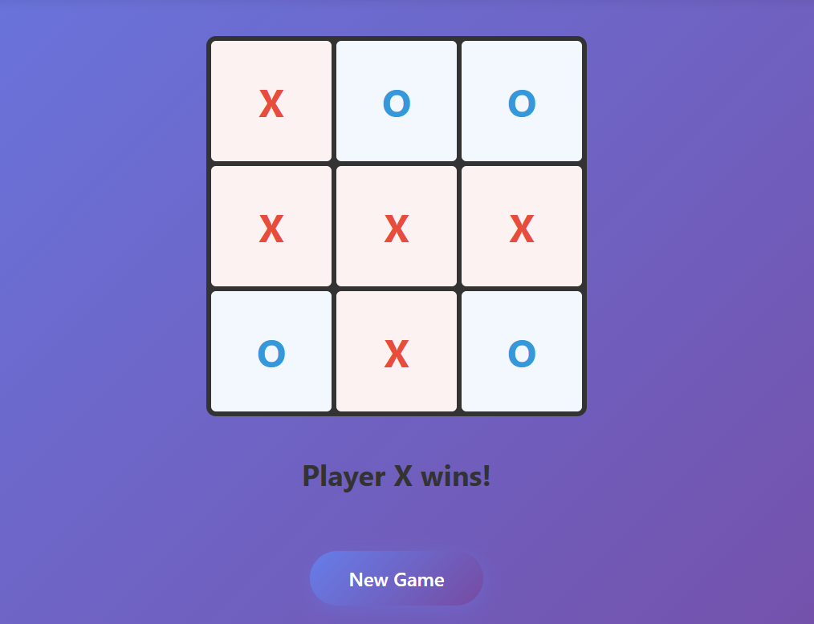

# Next.js Tic-Tac-Toe Game with Zustand Multiplayer


A real-time multiplayer tic-tac-toe game built with Next.js and Zustand Multiplayer middleware, demonstrating how to create multiplayer games with synchronized state.



## Prerequisites

You need an API key to run this example:

- Sign up at [HPKV Website](https://hpkv.io/signup)
- Navigate to [Dashboard](https://hpkv.io/dashboard)
- Create an API Key  
- Note down the API Key and API Base URL. Follow the instructions below to set these values in your .env file

## Getting Started

1. **Clone and setup the monorepo:**
   ```bash
   git clone https://github.com/hpkv-io/zustand-multiplayer.git
   cd zustand-multiplayer
   pnpm install
   ```

2. **Environment Setup:**
   Copy the example environment file in this directory:
   ```bash
   cp examples/nextjs-tic-tac-toe/.env.example examples/nextjs-tic-tac-toe/.env.local
   ```

   Edit the `.env.local` file with your HPKV credentials:
   ```env
      HPKV_API_KEY=your_api_key_here
      HPKV_API_BASE_URL=your_api_base_url
      NEXT_PUBLIC_HPKV_API_BASE_URL=your_api_base_url
      NEXT_PUBLIC_SERVER_URL=http://localhost:3000
   ```

3. **Build the package (required):**
   ```bash
   # From monorepo root - build the zustand-multiplayer package first
   pnpm turbo build --filter=@hpkv/zustand-multiplayer
   ```

4. **Run the example:**
   ```bash
   # From monorepo root
   pnpm --filter nextjs-tic-tac-toe dev
   
   # Or use Turbo
   pnpm turbo dev --filter nextjs-tic-tac-toe
   ```

5. **Play the game:**
   Navigate to `http://localhost:3000` in multiple browser windows or tabs to play tic-tac-toe together in real-time!

