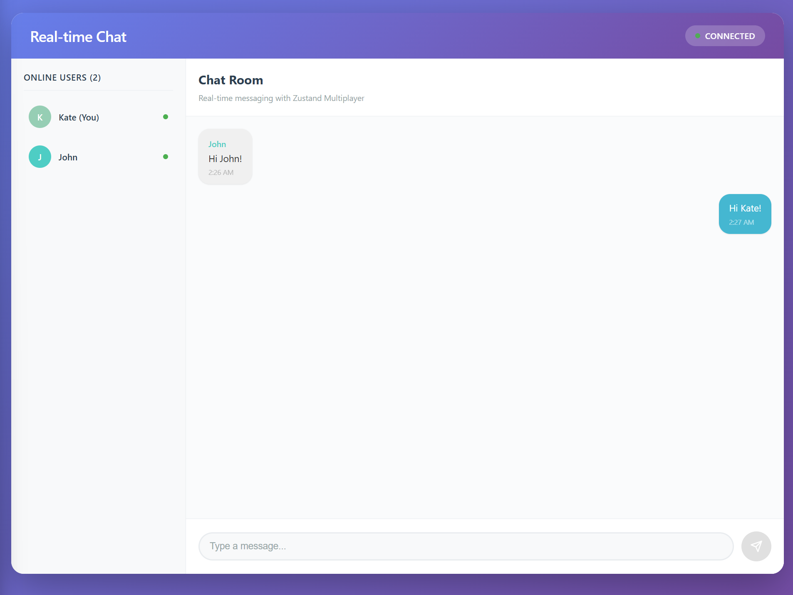

# Real-time Chat Application - React Example

A beautiful real-time chat application demonstrating the power of Zustand Multiplayer middleware. This example showcases real-time messaging, user presence, typing indicators, and automatic user management.




## Quick Start

### 1. Install Dependencies

```bash
npm install
```

### 2. Set Up Environment Variables

Copy the environment file and configure your HPKV credentials:

```bash
cp .env.example .env
```

Edit `.env` and add your HPKV API credentials:

```env
HPKV_API_KEY=your_hpkv_api_key_here
HPKV_API_BASE_URL=https://api.hpkv.io
VITE_HPKV_API_BASE_URL=https://api.hpkv.io
VITE_SERVER_URL=http://localhost:3001
PORT=3001
```

> **Get your API key**: Sign up at [hpkv.io](https://hpkv.io/signup) and get your API credentials from the [dashboard](https://hpkv.io/dashboard/api-keys).

### 3. Start the Token Server

The token server handles secure authentication for the multiplayer middleware:

```bash
npm run server
```

### 4. Start the Development Server

In a new terminal, start the React development server:

```bash
npm run dev
```

### 5. Open Multiple Browsers

Visit `http://localhost:5173` in multiple browser windows or tabs to see real-time synchronization in action!

## How It Works

### Zustand Store with Multiplayer

The chat application uses Zustand with the multiplayer middleware to create a real-time synchronized store:

```typescript
// src/store/chatStore.ts
export const useChatStore = create<WithMultiplayer<ChatState>>()(
  multiplayer(
    (set, get) => ({
      messages: {},
      users: {},
      currentUser: null,
      typingUsers: [],
      
      addMessage: (text: string) => {
        // Messages automatically sync to all clients
        set((state) => ({
          messages: {
            ...state.messages,
            [messageId]: newMessage,
          },
        }));
      },
      
      // ... more actions
    }),
    {
      namespace: 'chat-app',
      tokenGenerationUrl: `${import.meta.env.VITE_SERVER_URL}/api/generate-token`,
      apiBaseUrl: import.meta.env.VITE_HPKV_API_BASE_URL,
      sync: ['messages', 'users'], // Only sync these fields
    }
  )
);
```

### Key Features Implementation

#### Real-time Messaging
Messages are stored in the synchronized state and automatically appear on all connected clients:

```typescript
addMessage: (text: string) => {
  const messageId = `${Date.now()}-${Math.random()}`;
  set((state) => ({
    messages: {
      ...state.messages,
      [messageId]: {
        id: messageId,
        text: text.trim(),
        userId: currentUser.id,
        username: currentUser.username,
        timestamp: Date.now(),
        color: currentUser.color,
      },
    },
  }));
}
```


#### User Presence & Cleanup
Users are automatically removed after 30 seconds of inactivity:

```typescript
removeInactiveUsers: () => {
  const now = Date.now();
  const INACTIVE_THRESHOLD = 30000; // 30 seconds

  set((state) => {
    const activeUsers = {};
    Object.entries(state.users).forEach(([userId, user]) => {
      if (now - user.lastSeen < INACTIVE_THRESHOLD || userId === state.currentUser?.id) {
        activeUsers[userId] = user;
      }
    });
    return { users: activeUsers };
  });
}
```

## Project Structure

```
src/
├── components/
│   ├── ChatRoom.tsx          # Main chat interface
│   ├── ChatMessage.tsx       # Individual message component
│   ├── MessageInput.tsx      # Message input with typing detection
│   ├── UserList.tsx          # Online users sidebar
│   ├── ConnectionStatus.tsx  # Connection status indicator
│   └── UsernameModal.tsx     # Username entry modal
├── store/
│   └── chatStore.ts          # Zustand store with multiplayer
├── styles/
│   ├── *.css                 # Component-specific styles
│   └── index.css             # Global styles
├── types/
│   └── chat.ts               # TypeScript type definitions
├── App.tsx                   # Main app component
└── main.tsx                  # React entry point
```

## Learn More

- **[Zustand Documentation](https://zustand.docs.pmnd.rs/)**
- **[HPKV API Documentation](https://hpkv.io/docs)**
- **[Zustand Multiplayer Middleware](../../README.md)**
