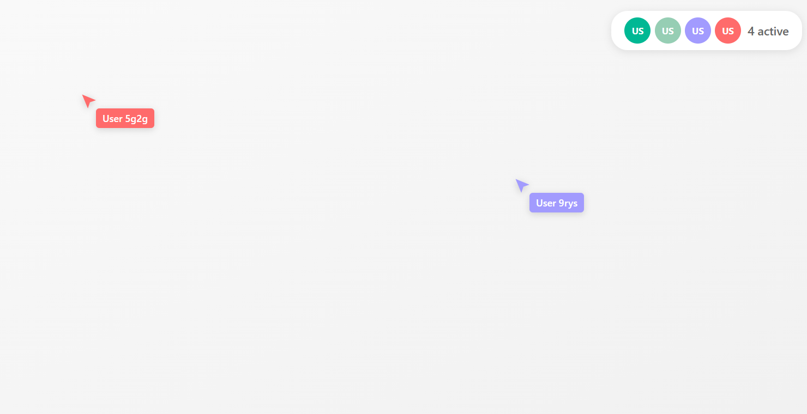

# React Live Cursors Example - Zustand Multiplayer


Real-time live cursors powered by [HPKV](https://hpkv.io) and [Zustand](https://zustand.docs.pmnd.rs/).




## Prerequisites

You need an API key to run this example:

- Sign up at [HPKV Website](https://hpkv.io/signup)
- Navigate to [Dashboard](https://hpkv.io/dashboard)
- Create an API Key  
- Note down the API Key and API Base Url. Follow the instructions below to set these values in your .env file

## Getting Started

1. **Clone and setup the monorepo:**
   ```bash
   git clone https://github.com/hpkv-io/zustand-multiplayer.git
   cd zustand-multiplayer
   pnpm install
   ```

2. **Environment Setup:**
   Copy the example environment file in this directory:
   ```bash
   cp examples/react-live-cursors/.env.example examples/react-live-cursors/.env
   ```

   Edit the `.env` file with your HPKV credentials:
   ```env
   HPKV_API_KEY=your_api_key_here
   HPKV_API_BASE_URL=your_api_base_url
   VITE_HPKV_API_BASE_URL=your_api_base_url
   ```

3. **Build the package (required):**
   ```bash
   # From monorepo root - build the zustand-multiplayer package first
   pnpm turbo build --filter=@hpkv/zustand-multiplayer
   ```

4. **Run the example:**
   ```bash
   # From monorepo root
   pnpm --filter react-live-cursors dev
   
   # Or use Turbo
   pnpm turbo dev --filter react-live-cursors
   ```

   This starts both the token generation API server (port 3000) and Vite dev server (port 5173).

4. **Open in multiple browser windows:**
   Navigate to `http://localhost:5173` in different browser windows and move your cursor to see synchronized live cursors in different windows